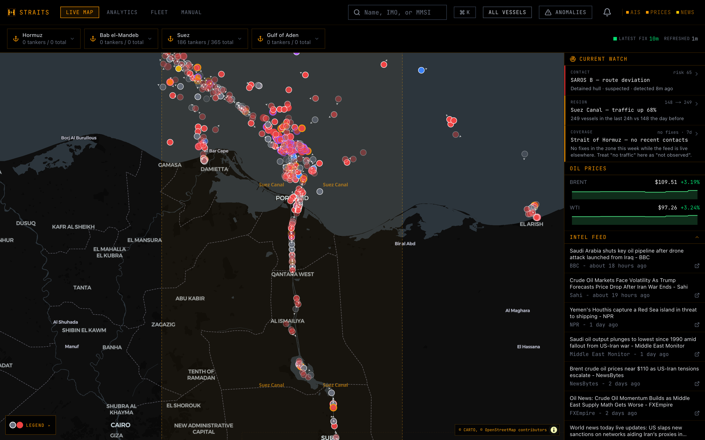
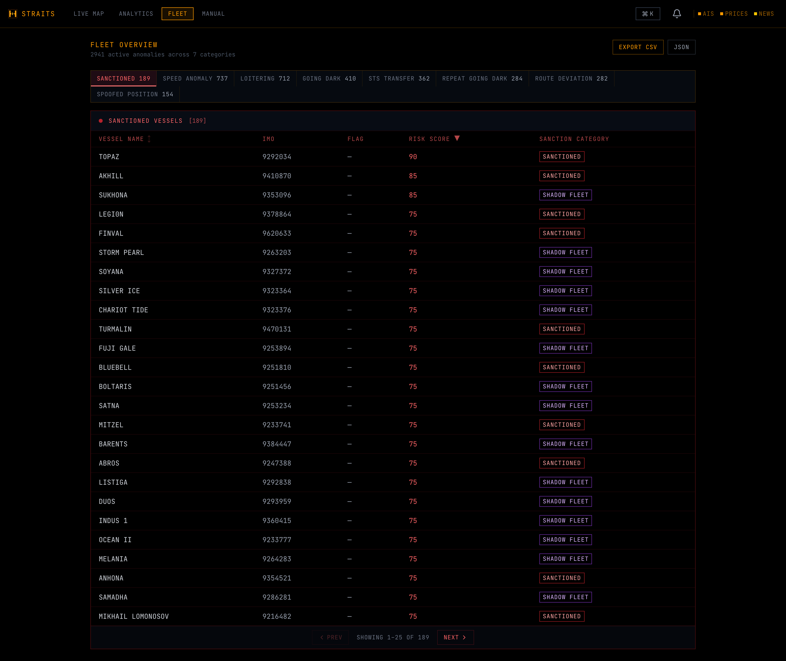
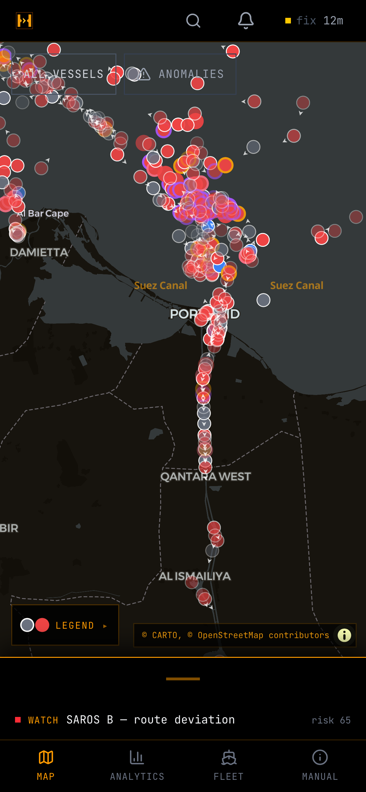
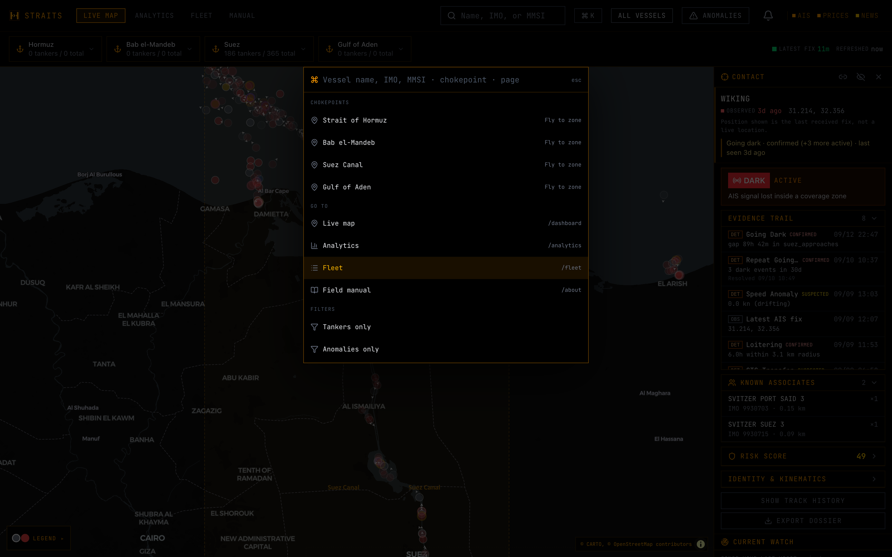
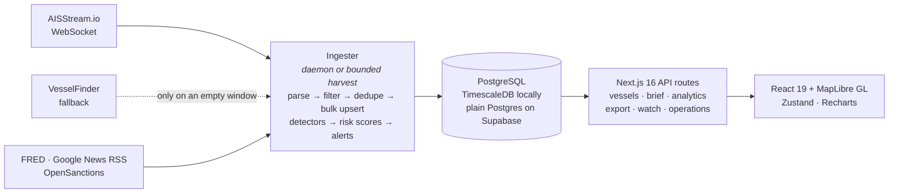

<p align="center">
  
</p>

<p align="center"><b>An independent maritime listening station for Middle East oil chokepoints.</b><br>
Live AIS contacts, sanctions matches, behavioral detectors, oil prices and news in one terminal — running at <a href="https://straits.randyren.org">straits.randyren.org</a>.</p>

---

Straits watches the Strait of Hormuz, Bab el-Mandeb, the Suez Canal and the Gulf of Aden and answers one question fast: **what is shipping actually doing there right now, and which hulls deserve a closer look?**

It ingests raw AIS position reports, resolves each contact to its IMO number, cross-references it against the OpenSanctions maritime list, and runs eight kinematic detectors over its recent track — AIS gaps inside coverage, loitering, route deviation, ship-to-ship rendezvous, spoofed jumps. Every conclusion is shown with the observations behind it, so a red dot is never just a red dot.



---

## What you can do with it

**Investigate a contact.** Click any dot for its dossier: identity and kinematics, the active detection with its confidence, an **evidence trail** that interleaves detector conclusions with the raw AIS observations they rest on, a **Known Associates** list of hulls it has met at sea, a 0–100 dark-fleet risk score with the factor breakdown, 24-hour track replay, and a one-click JSON dossier export.


**Start from what matters.** The **Current Watch** panel on the first screen is composed server-side from three kinds of evidence — a contact with a fresh event, a region whose traffic moved, a coverage gap you should read as "not observed" rather than "no traffic". Each card is one tap from its supporting view.

**Sweep the fleet.** The Fleet page groups every active anomaly by type — sanctioned, speed anomaly, loitering, going dark, STS transfer, repeat going dark, route deviation, spoofed position — sortable, paged, and exportable as CSV or JSON.



**Watch specific hulls.** Add a vessel to your watchlist and the notification bell becomes a personal inbox of *its* anomalies instead of a fleet-wide firehose. Fleet-level alerts fire separately when a chokepoint's throughput leaves its statistical-process-control band.

**Ask for a SITREP.** `GET /api/brief/hormuz` (or `?format=md`) returns a timestamped situation brief: counts, anomaly breakdown, top-risk hulls present, prices, GPS-jamming ratio and relevance-ranked news.

**Move fast.** `⌘K` opens a command palette that jumps to any vessel, chokepoint, page or filter. The link icon on a contact copies a URL that reproduces the contact, the map view and your filters. The whole thing works on a phone.

<table>
  <tr>
    <td width="30%"></td>
    <td width="70%"></td>
  </tr>
</table>

---

## Detection engine

Detectors run against the position history after every ingest pass. Thresholds are the ones in the code and on the in-app **Manual** page.

| Detector | Fires when | Confidence |
|---|---|---|
| Going dark | AIS gap inside one of 5 terrestrial coverage zones (gaps in open ocean are normal) | Suspected 2–4 h · Confirmed > 4 h |
| Repeat going dark | ≥ 3 going-dark events in 30 days | Confirmed |
| Loitering | Within ~5 nm for > 6 h outside 8 known anchorages; a fresh (≤ 15 min) anchored/moored nav-status suppresses it, a stale one doesn't | Confirmed |
| Route deviation | Heading > 45° off the bearing to the declared destination for 2 h+, or < 3 kt outside an anchorage | Suspected |
| Spoofed position | Implied speed > 50 kt between consecutive reports | Confirmed |
| STS transfer | Two hulls within ~0.5 nm for ≥ 30 min; every encounter is archived to a rendezvous ledger | Suspected / Confirmed |
| Composite diversion | Declared-destination flip followed by an evasion signal within 24 h | Upgraded to confirmed on a junk destination |
| SPC throughput | Chokepoint daily count leaves the z-score band of its 14-day baseline | Fleet-level alert |

**Risk score** is identity-first: a hull on a sanctions list scores 25 points the moment it appears, before any behavior. Going dark adds 8 per event (capped at 40), flag risk 15, loitering and STS 10 each, repeat rendezvous 5. Caps keep any one factor from saturating the 0–100 range.

Everything is plain kinematics — no ML. An STS closest-point-of-approach *predictor* exists but its alerts are gated off until there is enough rendezvous ground truth to validate precision.

---

## Data sources

Everything except the AIS feed is keyless.

| Layer | Source | Key |
|---|---|---|
| AIS positions | [AISStream.io](https://aisstream.io) WebSocket, bounded to six Middle East boxes | Free key required |
| AIS fallback | VesselFinder public map feed, used only when AISStream delivers nothing, and rejected unless it yields positions inside our own coverage | None |
| Sanctions | [OpenSanctions](https://www.opensanctions.org) maritime dataset, IMO-matched (CC BY-NC 4.0) | None |
| Oil prices | FRED (WTI `DCOILWTICO`, Brent `DCOILBRENTEU`), Alpha Vantage as fallback | Optional |
| News | Google News RSS, keyword-scored and deduped | None |
| Basemap | MapLibre GL + CARTO dark-matter | None |

---

## Run it locally

Prerequisites: Node 22+, Docker.

```bash
git clone https://github.com/randyren278/straits.git && cd straits
./run.sh
```

`run.sh` starts (or reuses) a TimescaleDB container, writes `DATABASE_URL` into `.env.local` if it isn't already there, applies the schema idempotently, installs dependencies, seeds ~140 demo vessels **only if the database is empty**, and opens the dashboard at **http://localhost:3000/dashboard**. No map token, no login.

```bash
./run.sh --reseed      # wipe and reseed the demo dataset
./run.sh --ingester    # also stream live AIS (needs AISSTREAM_API_KEY in .env.local)
```

For live data, put a free `AISSTREAM_API_KEY` in `.env.local` and run the always-on ingester (`npm run ingester:dev`) or use `--ingester`. The manual equivalent of `run.sh` is in [`scripts/README-dev.md`](scripts/README-dev.md).

### Optional shared-password gate

The app is open by default. Set both `JWT_SECRET` and `PASSWORD_HASH` (bcrypt) and `src/proxy.ts` starts requiring a signed session cookie for every page and API route except `/login`, `/api/health`, `/api/ready` and `/api/status`. This is an access perimeter for a small group, not a multi-user authorization system — see [`SECURITY.md`](SECURITY.md).

---

## How it's built



- **Two runtimes, one codebase.** Ingest never runs inside Next.js. `src/services/ais-ingester/index.ts` is the always-on daemon (persistent socket, cron detectors) for a server; `harvest-once.ts` collects one ~90 s window, runs the same detectors once, and exits under a hard timeout.
- **IMO is identity.** MMSI can be reused or spoofed mid-voyage, so every vessel-keyed table joins on IMO. Positions arrive with MMSI and resolve by join.
- **Freshness is honest.** The header separates *latest fix* (newest observation anywhere) from *refreshed* (when the UI last asked). `/api/status` classifies AIS, prices and news as live / degraded / offline purely from row timestamps, so it costs no external calls.
- **Dual-engine schema.** Queries use `date_trunc`, not `time_bucket`, so [`src/lib/db/schema.sql`](src/lib/db/schema.sql) (hypertable) and [`scripts/schema-portable.sql`](scripts/schema-portable.sql) (plain table) run the same code. Row-level security is enabled on every table with zero policies, which closes Supabase's PostgREST surface without touching the server-side pool.

### Production topology

The live site is Next.js on **Vercel** against **Supabase** Postgres. Serverless can't hold a WebSocket open and there is no keyless AIS source, so live positions are fed by a **bounded harvest on a Mac** every 10 minutes via a `launchd` LaunchAgent, with an optional SwiftBar menu-bar readout, single-flight locking, freshness-gated enrichment, retention pruning and a `status.json` heartbeat. Three consecutive empty AIS windows raise a macOS notification, and when `/api/status` reports the feed offline the site shows a banner instead of a blank map. Full ops notes are in [`docs/HARVESTER.md`](docs/HARVESTER.md).

### API surface

| Group | Routes |
|---|---|
| Vessels | `GET /api/vessels`, `/api/vessels/search`, `/api/vessels/{imo}/history`, `/api/vessels/{imo}/risk`, `/api/vessels/{imo}/associates`, `/api/positions/{mmsi}` |
| Intelligence | `/api/anomalies`, `/api/chokepoints`, `/api/chokepoints/{id}/vessels`, `/api/brief/{chokepoint}`, `/api/watch` |
| Analytics | `/api/analytics/traffic`, `/api/analytics/correlation` |
| Per-user | `/api/alerts`, `/api/alerts/{id}/read`, `/api/watchlist` (keyed by an `X-User-Id` header) |
| Feeds | `/api/prices`, `/api/news` |
| Export | `/api/export?format=csv\|json` (fleet snapshot), `/api/export/vessel/{imo}` (dossier) |
| Ops | `/api/health`, `/api/ready`, `/api/status` (public), `/api/operations` (pipeline runs + risk-score freshness) |

The full subsystem map, key files, decisions and gotchas are in [`docs/ARCHITECTURE.md`](docs/ARCHITECTURE.md).

---

## Verification

CI runs lint, typecheck and the test suite on every push and PR, applies the portable schema and migrations twice against Postgres 17 to prove idempotence, and CodeQL scans the tree.

```bash
npm run check          # eslint + tsc + vitest (699 tests)
npm run verify         # Playwright layout assertions for the dashboard and fleet pages
```

---

## Limitations

- **Coverage is wherever someone runs a receiver.** AISStream is a terrestrial network; a zone can show zero contacts while the feed is live. The UI labels this as a coverage gap, and the Analytics page says "no observations" instead of drawing an empty chart. Satellite AIS with guaranteed Gulf coverage is a paid product — the options are costed in [`docs/AIS-FALLBACK.md`](docs/AIS-FALLBACK.md).
- **AISStream is free, beta and has no SLA.** It has gone dark for weeks at a time. The fallback keeps the map populated but carries no IMO or destination, so sanctions matching and deviation detection degrade with it.
- **Detectors conclude; they don't prove.** A confirmed going-dark event is a signal gap inside coverage, not evidence of intent. Thresholds are published in the app so you can judge them.
- **Sanctions data is CC BY-NC 4.0.** OpenSanctions' maritime dataset is licensed for non-commercial use.
- **Per-user state is a browser UUID.** Watchlists and alert inboxes are keyed by a client-supplied id, not a verified account.
