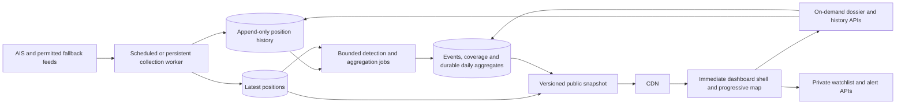

# Straits performance and scalability audit

Measured September 28, 2026, Vancouver time (September 29 UTC). Local source: `9af80fe`. Live site: https://straits.randyren.org/dashboard. The deployed commit was not independently resolved; source findings are distinguished from live measurements below. See [the implementation checkpoint](PERFORMANCE_IMPLEMENTATION_2026-09-29.md) for subsequent local fixes and remaining release gates. Production migration, release, field measurements, and the staging soak remain open; the audit is not yet closed.

## Decision

The slow first load is reproducible. Under the mobile lab profile, the dashboard's vessel-ready signal takes **9.66–10.33 seconds**, even when the vessel endpoint is served from CDN cache. On desktop it takes **6.54 seconds on a cache miss versus 2.05–2.13 seconds on hits**. Both the server read path and the browser loading sequence need attention.

Keep Next.js, MapLibre, and Postgres. First remove repeated work and the database dependency from the initial dashboard shell. Then maintain current vessel state and regional summaries as small read models. Collection must remain on the owner's Mac; surface its freshness and coverage limits plainly, and harden the existing launchd restart, single-flight, and outage paths. A framework rewrite, global WebSocket service, or new distributed database is not justified by this evidence.

At the time of this baseline audit, application behavior, production configuration, and database contents were unchanged. The linked implementation checkpoint records later local changes.

## Method and evidence

- Three desktop and three simulated-mobile navigations in the final measurement set. Chrome `154.0.8037.58`, automated with the repository's Playwright. Desktop: 1440×1000, unthrottled host connection. Mobile: 390×844, 1.6 Mbps download, 750 Kbps upload, 150 ms configured latency, 4× CPU throttling.
- A new browser context and disabled browser HTTP cache for each navigation. CDN cache states were observed, not forced. These are **browser-cache-cold visits**, not proven server cold starts; OS, browser process, V8, GPU, and network state may remain warm.
- Native performance observers captured FCP, LCP, layout shifts, and long tasks. CLS uses the maximum session window (one-second gap / five-second maximum). The earlier exploratory set used a sum of shifts; use `verified/` for CLS comparisons.
- App readiness is the first `data-reveal-state="ready"` on `vessel-map-surface`. Source sets it after data submission and MapLibre `idle`. It marks the beginning of the reveal transition, not the end of its CSS animation. Screenshots and requests were captured five seconds later.
- Eight additional normal API GETs: one request and a three-request batch for each of two endpoints. No cache busting; maximum three simultaneous requests. This is a small concurrency smoke, **not a saturation or capacity test**.
- Live database diagnostics used `.env.harvester`, one connection, `BEGIN READ ONLY`, and an eight-second transaction-local statement timeout. Three `EXPLAIN (ANALYZE, BUFFERS)` SELECT plans, catalog statistics, and index definitions. No migrations, writes, or detector execution. These credentials target the live harvesting database; the Vercel environment was not separately inspected.
- These samples cannot establish field p75, p95, INP, a Lighthouse score, Safari behavior, or maximum supported users. CPU/GPU behavior on physical phones can differ. No application RUM integration was found in the source searched.

Evidence: [final browser traces](../artifacts/performance/2026-09-28/verified/), [final database plans](../artifacts/performance/2026-09-28/verified/database.json), [API smoke](../artifacts/performance/2026-09-28/api-concurrency.json). The parent directory also preserves the exploratory runs and earlier database plan.

## First-load results

| Final run | HTML first byte | HTML complete | FCP | LCP | Vessel-ready signal | CLS | Vessel CDN state |
|---|---:|---:|---:|---:|---:|---:|---|
| Desktop 1 | 0.223s | 1.936s | 0.584s | 2.868s | 6.536s | 0.0750 | MISS |
| Desktop 2 | 0.125s | 1.300s | 0.332s | 1.744s | 2.048s | 0.0750 | HIT |
| Desktop 3 | 0.202s | 1.364s | 0.440s | 1.716s | 2.133s | 0.0750 | HIT |
| Mobile 1 | 0.191s | 1.590s | 1.552s | 5.168s | 9.775s | 0.0008 | STALE |
| Mobile 2 | 0.132s | 1.503s | 1.508s | 5.000s | 9.656s | 0.0008 | HIT |
| Mobile 3 | 0.153s | 4.834s | 1.512s | 5.944s | 10.330s | 0.0008 | HIT |

All six navigations reached readiness; no captured page exceptions or failed HTTP responses. The exploratory desktop cache miss took 7.06s, and an initial curl request took 7.04s to finish streaming HTML despite a 0.28s first byte. Latency varies enough that the median alone conceals a meaningful problem.

**LCP is incomplete for this product.** The recorded LCP element was a paragraph on desktop and a div on mobile. It does not establish that the WebGL map has useful vessel data. FCP can describe the loading screen. Maintain both Web Vitals and an explicit map-ready measurement. Google's guidance also distinguishes lab diagnostics from real-user evidence and recommends LCP ≤2.5s for at least 75% of visits. [Source](https://web.dev/articles/optimize-lcp)

The final traces captured 59 desktop / 58 mobile page-target requests, including **17 API requests per visit**. Approximately **623 KB of encoded page-target JavaScript** and **1.32–1.36 MB of captured encoded responses** were transferred by the end of the observation window. These totals exclude worker-internal requests and are lower bounds, not complete browser transfer sizes. An independent fetch found the worker's shared module is another 513 KB decoded / approximately 148 KB gzip; it imports after worker startup. Basemap glyph traffic is also substantial.

`/api/vessels` returned **5,163 records and 2,587,643 decoded JSON bytes**, roughly 234–235 KB encoded in browser traces. Sending this complete enriched fleet every 30 seconds costs bandwidth and repeated parse/GeoJSON processing even on a cache hit.

## Findings, ranked

### High: optional map centering blocks the real dashboard

[`dashboard/page.tsx`](../src/app/(protected)/dashboard/page.tsx) awaits `getInitialCenter()` before returning `DashboardClient`. `getChokepointStats()` runs four queries concurrently, one per chokepoint. The route-group loading fallback explains why headers/FCP can arrive while the usable dashboard is still absent.

The same counts are requested again after hydration. In the final mobile outlier, the main dashboard header appeared at 4.82s even though HTML began at 0.15s.

**Change:** render the shell and start map/data acquisition without waiting for live centering. Use a default or a previously generated center. Resolve deep links first; avoid a late automatic camera jump after the visitor interacts. A skeleton alone will improve feedback but cannot remove the underlying wait. The installed Next.js loading and lazy-loading guides were inspected for these recommendations.

**Verification:** artificially delay count data by 10s; navigation, controls, and map acquisition must still begin immediately. Verify shared vessel/chokepoint links retain their intended view. Repeat the live-like lab profile after implementation.

### High: repeated startup requests amplify database work

Every measured visit fetched prices twice, news twice, watchlist twice, and chokepoint stats twice. It then fetched **all four chokepoint vessel lists**, even without opening a dropdown. This also happened on phones where the desktop widgets are hidden.

[`DashboardClient`](../src/app/(protected)/dashboard/DashboardClient.tsx) mounts two `RailPanels` trees; [`IntelDrawer`](../src/components/dashboard/IntelDrawer.tsx) keeps its children mounted while closed. [`OilPricePanel`](../src/components/panels/OilPricePanel.tsx), [`NewsPanel`](../src/components/panels/NewsPanel.tsx), and [`WatchlistPanel`](../src/components/panels/WatchlistPanel.tsx) fetch independently. [`ChokepointWidget`](../src/components/ui/ChokepointWidget.tsx) eagerly fetches all lists. The shared poller already deduplicates status, coverage, watch, and alerts, so extend that existing mechanism.

**Change:** share prices/news/watchlist/count fetches, mount costly panels when needed, and fetch a chokepoint list only when opened. Keep user-specific keys isolated. Add visibility-aware polling, cancellation, jitter, and backoff; source polling currently has no document-visibility check. Do not assume CSS hiding stops effects.

**Verification:** trace one desktop and one phone startup; each shared URL has one initial request and unopened lists have none. Opening a list still works; rotation preserves the intended panel state; hidden tabs stop periodic refresh and resume with a bounded refresh.

### High: current-state queries repeatedly walk position history

Both display staleness constants are **seven days**, despite comments in chokepoint helpers referring to one hour. The live catalog estimates 272,677 position rows, with 76.2 MB for the relation and its indexes. The current-vessel subquery visits all 272,677 rows through `idx_positions_mmsi_time` to produce 5,161 latest MMSIs.

Measured database execution:

| Query | Server execution | Observation |
|---|---:|---|
| Enriched current vessels, exploratory | 381ms | 280,882 shared buffer hits; no shared reads |
| Same query, final | 1,937ms | Same row count and buffer-hit count; elapsed time varied substantially |
| One actual Hormuz count, final | 521ms | 290,756 shared buffer hits; scans history before spatial filtering |
| Latest observation timestamp, final | 3.3ms | Uses the time index; only five shared buffer hits |

Buffer hits are repeated accesses, not unique physical pages. These samples do not isolate CPU contention or explain every millisecond of the much slower HTTP responses. They do establish significant repeated work even with data in shared buffers. The existing indexes are present and used; “add the MMSI/time index” would repeat an existing provision.

[`getCurrentWatch`](../src/lib/watch/current-watch.ts) also fans out to **14 queries**: one events query, four recent/previous traffic queries, four SPC queries, four coverage timestamps, and one global timestamp. Its CDN cache helps, but regeneration still competes with normal reads and ingestion.

**Change:** first combine four counts into one calculation and cache the public result. Next maintain `vessel_latest_position`, keyed by observed MMSI with explicit source/observation time, joined to separately resolved IMO identity. Preserve null-IMO contacts. Update only when a new fix is newer; handle ties and multiple sources deterministically. Produce public regional stats and watch summaries once per harvest or scheduled refresh.

Do not fix the scan by filtering historical rows geographically before choosing each vessel's latest fix: that can incorrectly retain a vessel that has since left the region. Existing dropdown queries already deserve a consistency review here. Also investigate the join expansion from 5,161 latest MMSIs to 5,163 output rows before enforcing a materialized identity relationship.

**Verification:** compare old/new outputs on a fixed snapshot, including moved vessels, missing IMO, stale fixes, tankers, sanctions, and out-of-order arrival. Explain both plans at current and 10× fixture volume. Ship portable Postgres and local Timescale-compatible migrations together.

### High: the mobile waterfall delays both acquisition and reveal

The browser downloads and evaluates the dashboard graph before `VesselMap`'s effect starts the vessel fetch and basemap style. In exploratory mobile run 2, these requests began around **4.22s**, the cached vessel response finished around **7.29s**, and the render-ready signal arrived around **9.70s**. A CDN hit cannot remove the earlier JavaScript delay or subsequent map work.

The map waits for `idle` to reveal. That deliberately protects against displaying an empty map, but also ties reveal to map-wide work. [`VesselMap`](../src/components/map/VesselMap.tsx) eagerly imports MapLibre; the initial dashboard graph also includes panels and chart code. A blanket lazy import of the critical map could add another waterfall.

**Change:** start the small public snapshot request earlier; load the map code promptly while deferring optional drawer, detail, export, and chart code. Trim the map response to rendering fields and fetch dossier fields on selection. Consider a simpler basemap/font configuration. Profile `idle` versus source-specific render readiness before changing the loading contract. Cache worker assets under versioned URLs before giving them immutable browser caching; their current stable URLs use `max-age=0, must-revalidate`.

**Verification:** retain delayed-data, empty-data, map-error, and retry checks. Confirm actual rendered markers, not merely a dismissed overlay. Measure bytes and request start times under the same mobile profile. Test a real phone before declaring the experience fixed.

### Medium: useful cache coverage is incomplete

`/api/vessels` already has 30s shared caching plus 60s stale-while-revalidate, and `/api/watch` has 60s plus 120s. Traces confirm HIT/STALE behavior. Public counts, coverage, prices, news, and list routes repeatedly missed and have no comparable source cache headers. By contrast, hashed Next assets already have immutable caching and the font already uses swap/preload.

**Change:** give public summaries TTLs aligned to collection cadence and expose `observedAt`, `generatedAt`, and source freshness separately. Validate cache keys and authorization behavior. Watchlists and alerts must remain user-specific; never broadly apply shared caching to `/api/*`. Cache the server-side initial-center computation too if it remains: API headers cannot cache a direct database call.

### Medium: pools, region placement, and worker coordination need an explicit budget

[`db/index.ts`](../src/lib/db/index.ts) creates a module pool with `max: 20`, 30s idle timeout, and 8s connection timeout. Twenty is a limit **per process/instance**, not for the whole deployment. Client connections through Supavisor are also distinct from physical Postgres backends. The application can multiply query concurrency as Vercel adds instances. One database snapshot showed 22 idle sessions; that does not prove a leak.

Vercel request IDs included `pdx1::iad1`; the configured harvester pooler is `us-west-2:6543`. This suggests cross-region application/database traffic, pending direct verification of Vercel's database URL and function settings. It is an additional hypothesis, not the measured cause of all latency.

**Change:** verify placement, measure pool wait time, and budget web and worker clients separately. Evaluate Vercel's documented pool lifecycle helper if this deployment uses Fluid Compute. Do not arbitrarily shrink every pool to one connection. Supabase recommends transaction pooling for serverless clients. [Vercel pooling](https://vercel.com/kb/guide/connection-pooling-with-functions), [Supabase connections](https://supabase.com/docs/guides/database/connecting-to-postgres)

Preserve the repository's transaction-pooler timeout precautions: use transaction-local limits with a checked-out client; do not issue unscoped session `SET` statements. Before scaling persistent workers, review [`runExclusiveJob`](../src/lib/db/pipeline-runs.ts): it uses session advisory locks, which need compatible session affinity. Do not assume a checked-out node-postgres client provides that through a transaction pooler. Validate coordination with two staging workers.

### Medium: collection and history are the next scaling constraints

The bounded harvester has useful batching, retries, step budgets, and a local single-flight lock. Its collection availability still depends on this Mac being awake and online. Its raw retention default is seven days. Growing that window or switching to continuous high-rate ingestion multiplies history size and detector work.

The STS detector's pairwise vessel join has quadratic candidate-growth risk before distance filtering. Several detector paths still process candidates individually. The permanent daemon writes individual messages, unlike the bounded harvester's batches. A larger deployment needs spatial candidate reduction and bounded processing, not simply more identical workers.

There are already durable `chokepoint_daily` crossing aggregates and collection-quality buckets; build on them. However, general traffic/SPC reads still aggregate raw positions. This is both a scaling limit and a mismatch with 30/90-day analytics when raw retention is shorter. Fleet renders 25-row panels but fetches the full anomaly collection: client display limits are not API pagination.

## What the concurrency test establishes

| Endpoint | One request | Three simultaneous requests | Cache |
|---|---:|---:|---|
| Chokepoint counts | 6.31s | 2.61s, 3.50s, 3.50s | All MISS |
| Vessel snapshot | 0.18s | 0.19s, 0.34s, 0.35s | All STALE |

All eight returned 200. The solo counts request was slower than the concurrent batch: instance state, background work, network, and database contention were uncontrolled. It would be incorrect to derive a scaling factor from these samples. They demonstrate variable uncached latency and the effectiveness of shared stale responses.

## Capacity model, not a capacity claim

For an idle, visible dashboard with the currently observed two panel copies, source intervals imply about **20.4 API requests per minute per visitor**, excluding initial requests and interactions:

| Poll family | Requests/minute/visitor |
|---|---:|
| Vessels | 2 |
| Chokepoint counts: widget + dashboard | 3 |
| Four chokepoint vessel lists | 8 |
| Status + coverage + watch | 3 |
| Alerts | 2 |
| Two price panels | 2 |
| Two news panels | 0.4 |

At 100 concurrent visible visitors that models **34 API requests/sec**; at 1,000, **340/sec**. These are browser requests, not database query rates or measured support limits. Counts alone imply 12 history-count queries/minute/visitor before caching improvements. Two 235 KB vessel downloads per minute across 1,000 visitors model roughly **28 GB/hour** of response traffic, even if CDN caching protects the origin. Compression, browser caching, tab visibility, and user behavior will change actual usage.

A new latest-position table scales with active contacts; raw history scales with observations × cadence × retention. For illustration, 5,000 contacts recorded once every ten minutes is 720,000 positions/day; once a minute is 7.2 million/day. Those are hypothetical rates, not the observed ingestion volume. Partitioning/retention and detector budgets should be based on that dimension, separately from visitor count.

## Recommended architecture



Start with Postgres read tables and existing Vercel caching. An object-storage snapshot is a later option if public fan-out or egress makes it worthwhile. Publish each snapshot atomically with a generation ID and observation timestamps; keep the last successful snapshot on job failure and label its age. A ten-minute source cadence rarely needs per-user WebSockets. Viewport tiles or delta updates become worthwhile only after measured fleet growth justifies their complexity.

## Implementation order and release gates

| Stage | Concrete work | Verification / success criterion |
|---|---|---|
| 1: Immediate load | Remove live-centering gate; deduplicate fetches; on-demand lists; reserve header/panel space | Delayed DB cannot block shell; no duplicate initial URLs; unopened lists issue zero requests; no regression in deep links or map-loading tests |
| 2: Reuse public work | Cache public summaries, combine counts, defer optional chart/panel code, compact map response | Trace HIT/STALE/MISS; private-data isolation checks; reduce initial API calls from 17 to ≤9; compare encoded bytes and mobile map readiness |
| 3: Bound read cost | Latest-position read table, durable regional aggregates, generation-based snapshots; verify regions/pool budget | Output parity on fixed fixtures; EXPLAIN at 1×/10× history; steady dashboard queries no longer depend on history length |
| 4: Reliable operation | Keep collection on this Mac; separate web/detector budgets, bound spatial candidates, and plan retention/partitioning | Mac sleep/wake and retry drill; local single-flight and detector lease checks; ingestion lag visible when the Mac is offline |
| 5: Capacity proof | Staging workload with production-like volume, mixed routes, cache expiry, concurrent ingest | Ramp 1/5/10/25/50 users with fixed dwell times; then a 30-minute soak; monitor p95, errors, DB CPU, pool wait, cache hit rate, egress, and ingestion lag |

Initial proposed budgets: lab map-ready ≤3s desktop / ≤5s under this mobile profile; field p75 LCP ≤2.5s, INP ≤200ms, CLS ≤0.1; cached public API p95 ≤250ms and origin summary p95 ≤1s. These are targets, not achieved results or guaranteed capacity. Web Vitals thresholds should be evaluated using real-user percentiles. [Web Vitals reference](https://web.dev/articles/vitals)

Add production RUM for LCP/INP/CLS plus custom `shell-ready`, `snapshot-received`, `map-style-ready`, and `vessels-rendered` marks. Record build, coarse device/connection category, response cache state where available, and failure reason without sending private watchlist/search contents. Add server spans for pool acquisition, query, serialization, and cache regeneration. This will distinguish a slow region, cold instance, growing history, and a slow phone.

## Reproduce

```bash
BASE_URL=https://straits.randyren.org RUNS=3 OUT_DIR=artifacts/performance/new-run node scripts/measure-first-load.mjs
BASE_URL=https://straits.randyren.org PROFILE=mobile RUNS=3 OUT_DIR=artifacts/performance/new-run node scripts/measure-first-load.mjs
BASE_URL=https://straits.randyren.org OUT_DIR=artifacts/performance/new-run node scripts/measure-api-concurrency.mjs
OUT_DIR=artifacts/performance/new-run node --env-file=.env.harvester scripts/measure-db-read-path.mjs
```

Run sequentially for comparable measurements. The browser script uses installed Google Chrome by default (`CHROME_CHANNEL` override). Never commit environment files. The database script extracts current source SQL and fails on unresolved template expressions; revisit it when query construction changes. A larger load test belongs on an isolated staging database, with an explicit stop condition, after the cheap duplicated work is removed.
